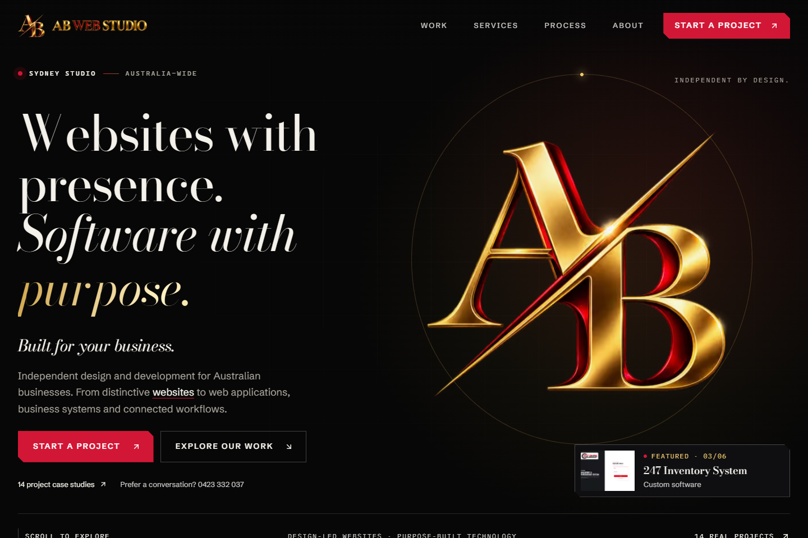
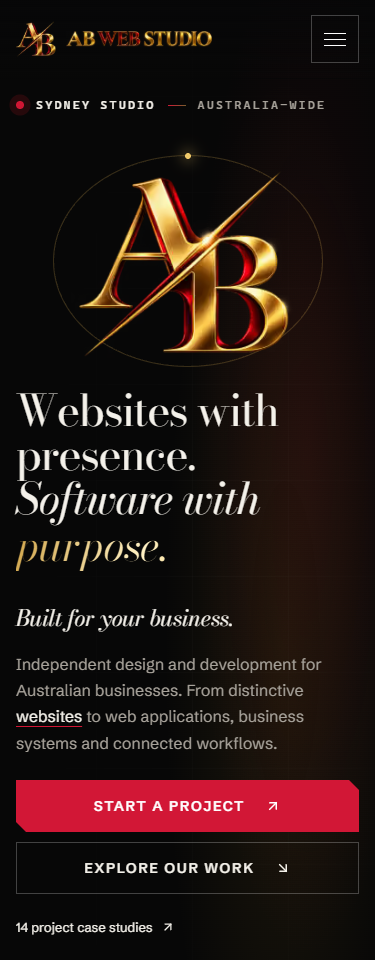

# Authentic AB hero verification

The hero uses a transparent crop of the approved repository artwork,
`public/brand/ab-logo-luxury-source.png`. Its staggered A/B geometry and diagonal
slash are preserved. The requested external logo file was unavailable.

The same artwork supplies the static fallback and the optional Three.js plane.
Phones and reduced-motion users receive the static version. The renderer pauses
offscreen, sleeps after interaction settles, caps DPR, and disposes its resources.

## Local verification

- Node 22: ESLint and TypeScript passed; 63 tests passed; 34 routes built.
- Production dependency audit: zero vulnerabilities.
- Browser home matrix: 320, 375, 390, 768, 1024, 1440 and 1920px.
- Corrected browser harness: 81 checks passed, including mobile navigation,
  invalid contact input, mocked success/failure, GPU readiness, pointer movement,
  idle/offscreen suspension, context-loss fallback and reduced motion.
- Interior route matrix inspected all canonical project/service routes at mobile
  and desktop widths. Cached navigation and intentionally deferred images are
  handled explicitly by the reusable final QA harness.
- Axe WCAG 2/2.1/2.2 A/AA checks passed homepage, Services, About and Contact.
  Work's final text colors passed with reduced motion; ordinary full-document
  scans can observe offscreen reveal opacity. Redundant portfolio link labels
  were removed following Lighthouse's label-content-name-mismatch finding.

## Performance evidence

Serial Chromium cold-cache harness: three samples, DPR 1, 4x CPU slowdown,
40ms latency and 10Mbps download. Median LCP: mobile 1.116s, desktop 1.000s.
CLS: mobile 0, desktop 0.000150.

Lighthouse uses different throttling: mobile performance 85, LCP 4.209s,
CLS 0, TBT 104ms; desktop performance 99, LCP 0.883s, CLS 0.000498,
TBT 0ms. Accessibility and SEO scored 100 on both. Local best practices 96
reflects the unavailable Vercel Speed Insights endpoint in local Next.js.
These are lab results; field INP was unavailable.

No valid enquiry was sent. Browser success/failure checks mock mail responses;
invalid-input checks use the actual endpoint. Production mail configuration
exists, but real delivery was not exercised. Optional Upstash and ClickHouse
configuration is absent; existing per-instance rate limiting remains active.

## Release boundaries

The isolated release includes the previously authored production-readiness
commit alongside the authentic hero correction. Unrelated root package changes
and the nested Gemini export remain untouched. Production uses the existing
Vercel project and its existing environment/domain configuration.

Rollback target before release:
`ab-digital-solutions-n0f4718b5-abubakerasif202s-projects.vercel.app`
(`dpl_4dk2MCzhERvKj5vpkz3eTarKQ23C`). Promote that deployment if a critical
production regression appears; do not reset shared Git history.
